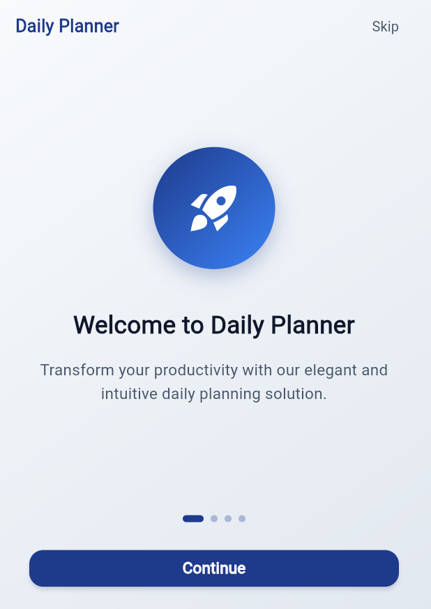
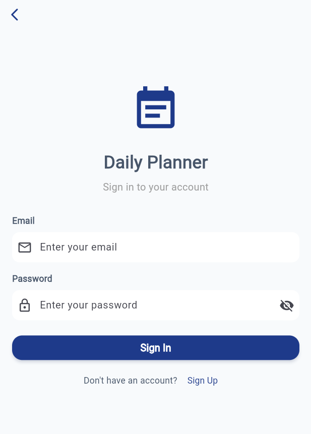
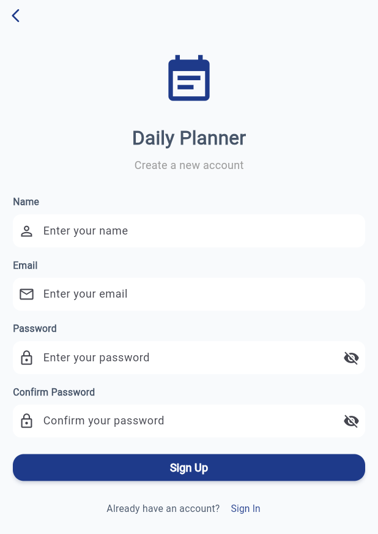
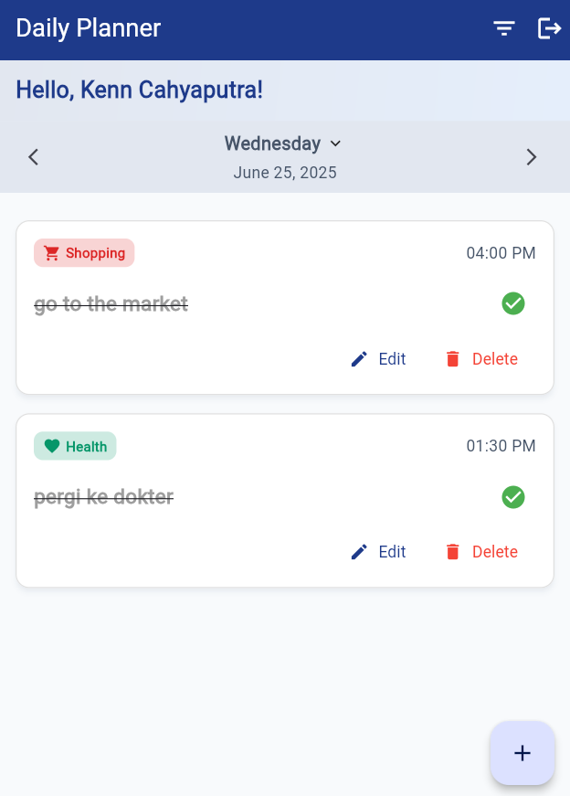
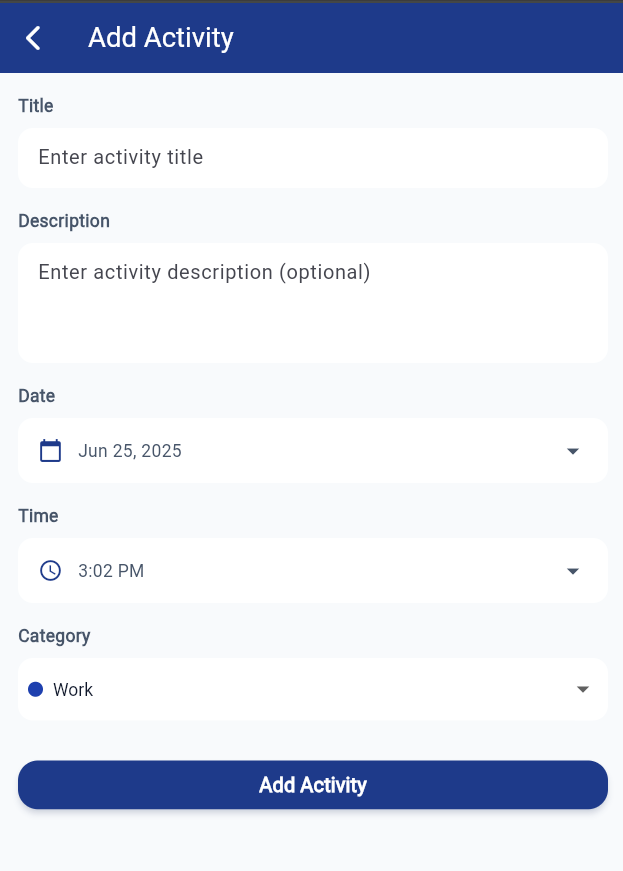
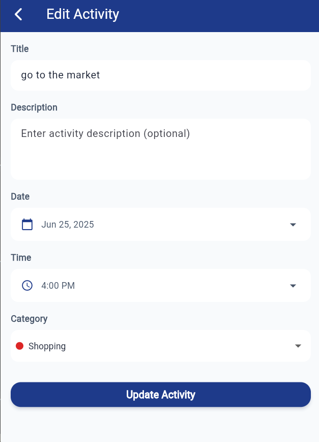

# Daily Planner App

## Setup Instructions

1. Clone the repository
2. Run the app:
   ```
   flutter pub get
   flutter run 
   ```
3. Demo Credentials
   ```
   E-MAIL: kenncahyaputra142@gmail.com
   PASSWORD: 12345678
   ```
## Screenshots







## Features
### Activity Management
- Add daily activities with specific time and category
- Mark activities as completed when done
- Edit or delete existing activities
- Filter activities by date and completion status

### User Authentication (via Supabase)
- Sign Up with email, password, and name
- Sign In with email and password
- Sign Out functionality
- Input validation and error messaging

### Cloud Database Integration
- Secure storage of user data using Supabase
- Activities are saved and fetched based on user ID
- Offline support with local storage using Hive

### Session Persistence
- User login sessions stored locally using Hive
- Automatic login on app relaunch if a session exists

### Get Started Screen
- Onboarding screens for first-time users
- Skips to login or home screen for returning users